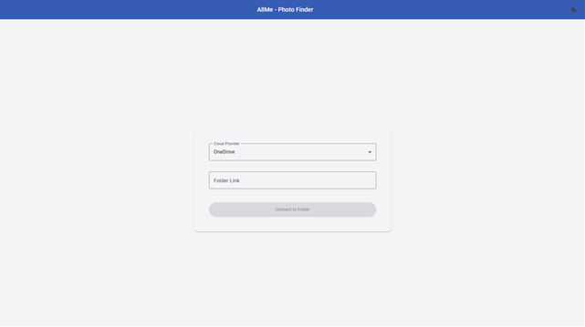
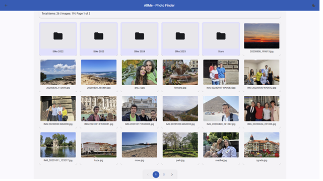
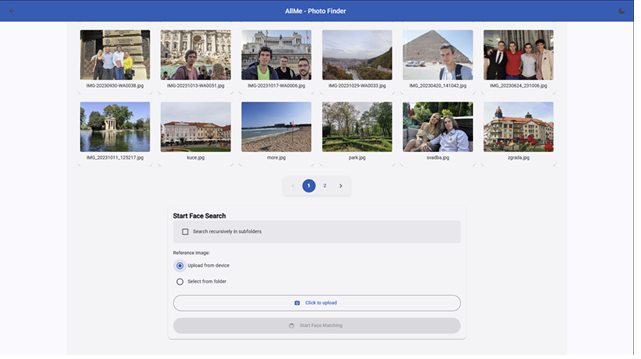
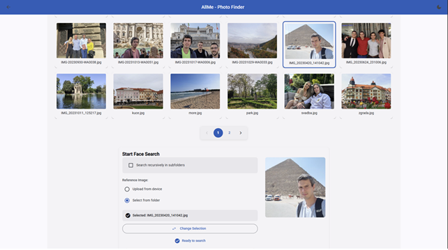
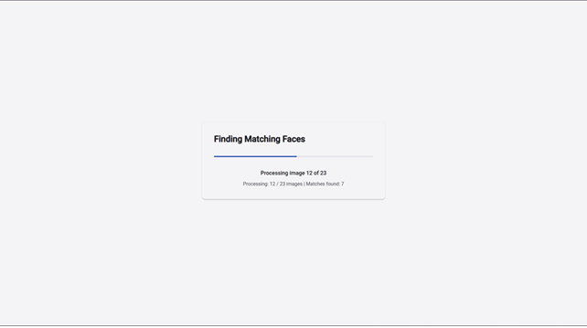
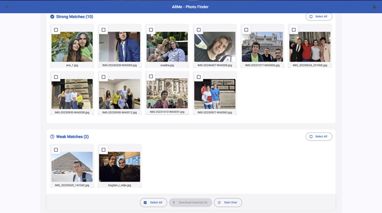

# AllMe - Find yourself in large shared drives 📸

<div align="center">

[](https://all-me.app)
[](https://go.dev/)
[](https://angular.dev/)
[](https://python.org/)
[](https://docker.com/)

</div>

---

## 🔍 Overview

**AllMe** is a web application that uses facial recognition to help you find photos of yourself across your cloud storage. Upload a reference photo, connect your OneDrive or Google Drive, and let AI do the heavy lifting—no more endless scrolling through thousands of vacation photos.

Results are categorized by match confidence based on facial similarity scores, and you can easily download your matches in bulk. The application supports recursive folder searches and batch processing of large photo collections.

🌐 **[Visit all-me.app](https://all-me.app)**

---

## 📸 Screenshots

<div align="center">

<p float="left">
  
  
</p>

<p float="left">
  
  
</p>

<p float="left">
  
  
</p>

</div>

---

## ✨ Features

### 🎯 Core Capabilities

- **Facial Recognition** - Advanced AI-powered face detection and matching using deep learning models
- **Multi-Provider Support** - Works seamlessly with OneDrive and Google Drive
- **Batch Processing** - Scan hundreds or thousands of photos efficiently with progress tracking
- **Confidence Scoring** - Results separated into strong and weak matches based on similarity scores
- **Recursive Search** - Search through nested folders and subdirectories
- **Bulk Download** - Download all matched photos or selected ones in a single operation
- **Session Management** - Maintains search state for easy navigation and result review

---

## 🏗️ Architecture

AllMe is built as a microservices architecture with three main components:

```
┌─────────────────────────────────────────────────────────┐
│                      Frontend (Angular)                  │
│            Responsive SPA with Material Design           │
└────────────────────┬────────────────────────────────────┘
                     │ HTTPS/REST API
┌────────────────────▼────────────────────────────────────┐
│                   Backend (Go/Echo)                      │
│  • OAuth Flow Management    • Cloud Storage Integration │
│  • Session Management       • Request Orchestration     │
│  • Job Status Tracking      • Download Coordination     │
└────────────────────┬────────────────────────────────────┘
                     │ HTTP/JSON
┌────────────────────▼────────────────────────────────────┐
│               Face Service (Python/FastAPI)              │
│  • Face Detection (dlib)    • Face Encoding              │
│  • Similarity Comparison    • Batch Processing          │
└─────────────────────────────────────────────────────────┘
```

### Component Details

#### Frontend (Angular 20)
- **Framework:** Angular 20 with standalone components
- **UI Library:** Angular Material for consistent design
- **State Management:** RxJS observables for reactive data flow
- **HTTP Client:** Interceptors for authentication and error handling
- **Routing:** Protected routes with navigation state

#### Backend (Go 1.25)
- **Framework:** Echo v4 - High-performance HTTP router
- **Architecture:** Clean architecture with dependency injection
- **Providers:** Abstracted interfaces for OneDrive and Google Drive
- **Concurrency:** Goroutines for parallel batch processing
- **Security:** Middleware for CORS, headers, and authentication

#### Face Service (Python 3.11)
- **Framework:** FastAPI for async API handling
- **ML Library:** face_recognition (built on dlib)
- **Image Processing:** Pillow for format handling
- **Algorithms:** 128-dimensional face encodings, Euclidean distance comparison
- **Optimization:** Batch processing with configurable chunk sizes

---

## 📁 Project Structure

```
AllMe/
├── frontend/                           # Angular 20 SPA
│   ├── src/
│   │   ├── app/
│   │   │   ├── components/            # UI components
│   │   │   ├── services/              # Business logic
│   │   │   ├── interceptors/          # HTTP middleware
│   │   │   ├── models/                # TypeScript interfaces
│   │   │   └── pipes/                 # Custom transformations
│   │   └── environments/              # Config per environment
│   ├── Dockerfile
│   └── package.json
│
├── backend/                            # Go microservice
│   ├── internal/
│   │   ├── auth/                      # OAuth 2.0 implementation
│   │   ├── face/                      # Face recognition orchestration
│   │   ├── storage/                   # Cloud storage abstraction
│   │   ├── download/                  # Bulk download service
│   │   ├── thumbnail/                 # Thumbnail proxy
│   │   ├── providers/
│   │   │   ├── googledrive/           # Google Drive integration
│   │   │   └── onedrive/              # OneDrive integration
│   │   └── middleware/                # Security & CORS
│   ├── pkg/
│   │   └── models/                    # Shared data models
│   ├── Dockerfile
│   ├── go.mod
│   └── main.go
│
├── face-service/                       # Python ML service
│   ├── main.py                         # FastAPI application
│   ├── requirements.txt
│   └── Dockerfile
│
├── docker-compose.yml                  # Production orchestration
├── docker-compose.override.yml.example # Local dev configuration
└── README.md                           # This file
```

---

## 🔧 Prerequisites

### For Docker Deployment (Recommended)
- **Docker** 20.10+ and **Docker Compose** 2.0+
- **OAuth Credentials** from Microsoft and/or Google

### For Local Development
- **Node.js** 18+ and **npm** 9+
- **Go** 1.25+
- **Python** 3.11+
- **CMake** and **dlib** (for face_recognition library)

---

## 🚀 Getting Started

### 1. Clone the Repository

```bash
git clone https://github.com/dragan-mitrasinovic/AllMe.git
cd AllMe
```

### 2. Configure Environment Variables

Create a `.env` file in the project root:

```env
# Domain Configuration
DOMAIN=all-me.app
FRONTEND_URL=https://all-me.app

# OneDrive OAuth (Register at https://portal.azure.com)
ONEDRIVE_CLIENT_ID=your_onedrive_client_id
ONEDRIVE_CLIENT_SECRET=your_onedrive_client_secret
ONEDRIVE_REDIRECT_URI=https://all-me.app/auth/onedrive/callback

# Google Drive OAuth (Register at https://console.cloud.google.com)
GOOGLEDRIVE_CLIENT_ID=your_googledrive_client_id
GOOGLEDRIVE_CLIENT_SECRET=your_googledrive_client_secret
GOOGLEDRIVE_REDIRECT_URI=https://all-me.app/auth/googledrive/callback
```

### 3. Local Development Configuration

**Important:** The base `docker-compose.yml` is configured for production deployment. For local development, you must create an override file:

```bash
cp docker-compose.override.yml.example docker-compose.override.yml
```

Edit `docker-compose.override.yml` to configure local ports and development URLs (e.g., `localhost:4200`, `localhost:8080`).

### 4. Run with Docker Compose

```bash
# Local development (uses override configuration)
docker-compose up -d

# Production deployment
docker-compose -f docker-compose.yml up -d

# Stop services
docker-compose down
```

The application will be available at the configured domain/port.

### 5. Alternative: Run Services Individually

```bash
# Frontend
cd frontend
npm install
npm start  # http://localhost:4200

# Backend
cd backend
go mod download
go run main.go  # http://localhost:8080

# Face Service
cd face-service
pip install -r requirements.txt
uvicorn main:app --host 0.0.0.0 --port 8081
```

---

## 🧪 API Endpoints

### Backend API (Port 8080)

#### Authentication
```
GET  /auth/:provider/initiate     # Start OAuth flow
GET  /auth/:provider/callback     # OAuth callback handler
GET  /auth/session/:sessionId     # Check session validity
```

#### Storage
```
POST /storage/browse              # Get folder contents
POST /storage/parse-link          # Parse shared link
```

#### Face Recognition
```
POST /face/register-base          # Register reference face
POST /face/compare-folder         # Start comparison job
GET  /face/job-status/:jobId      # Get job progress
DEL  /face/clear-reference/:sessionId  # Clear face encoding
```

#### Download
```
POST /download/prepare            # Prepare ZIP download
GET  /download/:downloadId        # Download prepared ZIP
```

#### Thumbnails
```
GET  /thumbnail                   # Proxied thumbnail (with auth)
```

### Face Service API (Port 8081)

```
POST /face/register               # Register face encoding
POST /face/compare-batch          # Compare batch of images
GET  /face/job-status/:jobId      # Get processing status
GET  /health                      # Health check
```
